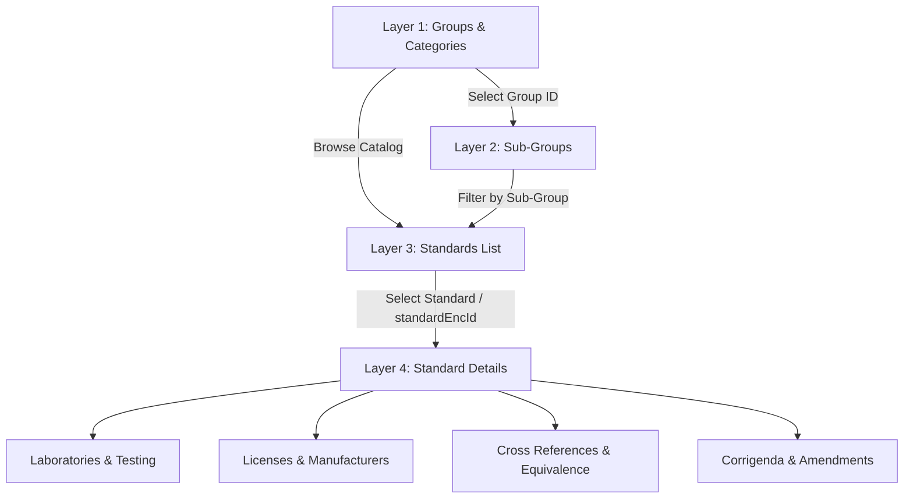

# BIS Data-Source Reconnaissance Report

## 1. Executive Summary

This report documents the reverse-engineered data architecture and API ecosystem of the official Bureau of Indian Standards (BIS) Published Standards portal (`https://standards.bis.gov.in/`). 

### Core Conclusion
**Direct HTML scraping is NOT required for the vast majority of BIS catalog and metadata needs.**
The BIS portal is powered by modern Angular single-page applications that communicate with several backend REST microservices hosted under `https://standardsadmin.bis.gov.in/`. These services expose public JSON endpoints providing comprehensive data for groups, subgroups, technical departments, full standard listings (~24,160+ published standards), laboratory testing facilities, product licenses, corrigenda, cross-references, and gazette notifications.

---

## 2. Website Entry Point & Frontend Architecture

- **Primary Entry URL**: `https://standards.bis.gov.in/website/published-standards/published-standard-groupwise?activeTab=group`
- **Frontend Framework**: Angular 16+ (SPA with client-side routing, RxJS observables, Angular HttpClient, and UI components).
- **Core Bundles Identified**:
  - `main.0378a405158883a1.js` (core routing, services, components, API client declarations)
  - `scripts.e2bfe9b974b5a2a5.js`
  - `polyfills.55d4c5f200113cc4.js`
  - `runtime.affa8939ec028402.js`
- **Authentication & Security Controls**:
  - **No user authentication** (no Bearer token or session cookie) is required for public catalog and standards inspection APIs.
  - Standard CORS headers with Origin: `https://standards.bis.gov.in` and Referer: `https://standards.bis.gov.in/`.
  - Standard `Content-Type: application/json` is required.
  - Rate limiting is modest; gentle spacing (e.g. 200–500ms between batch requests) is recommended during ingestion.

---

## 3. Microservice Base URLs Discovered

The BIS frontend coordinates requests across several dedicated backend microservices:

| Service Name | Base URL | Primary Role |
| :--- | :--- | :--- |
| **Proposal Service** | `https://standardsadmin.bis.gov.in/proposal-service/` | Standards listing, proposal workflow, search, and standard counts |
| **Project Service** | `https://standardsadmin.bis.gov.in/project-service/` | Group names, subgroups, technical departments, stage tracking |
| **Review Service** | `https://standardsadmin.bis.gov.in/review-service/` | Standard laboratory details, licenses, cross-references, gazettes, count metrics |
| **Master Service** | `https://standardsadmin.bis.gov.in/master-service/` | Committee members, HODs, organizational structure, sector definitions |
| **SDO Service** | `https://standardsadmin.bis.gov.in/sdo-service/` | Recognized Standards Developing Organizations (SDOs) |
| **Document Storage (MinIO)** | `https://bmqsdqljvwgm.compat.objectstorage.ap-mumbai-1.oraclecloud.com` | Standard document downloads and PDF attachments |

---

## 4. Multi-Layer Endpoint & Navigation Map



### Layer-by-Layer Verification

| Layer | Endpoint | Method | Status | Purpose |
| :--- | :--- | :--- | :--- | :--- |
| **Layer 1: Groups** | `/project-service/getWebsiteGroupName` | `POST` | **VERIFIED** | Retrieves all 41 top-level groups (e.g., Electronics, Civil, Chemical, Food). |
| **Layer 1: Counts** | `/review-service/getWebsiteGroupWisePSCount` | `POST` | **VERIFIED** | Retrieves published standard counts per group. |
| **Layer 1: Departments** | `/project-service/getWebsiteTechnicalDepartments` | `POST` | **VERIFIED** | Retrieves all 15 technical departments (e.g., CHD, CED, LITD, PGD, TXD). |
| **Layer 2: Sub-Groups** | `/project-service/getWebsiteSubGroupsByGroupIds` | `POST` | **VERIFIED** | Retrieves sub-groups for a given `groupIds: [groupId]`. |
| **Layer 3: Standard List** | `/proposal-service/getWebsiteIndianStandardsList` | `POST` | **VERIFIED** | Lists standards with pagination, filtering, search, and basic metadata. |
| **Layer 4: Standard Details** | `/review-service/getStandardFormatDocumentDetails` | `POST` | **VERIFIED** | Standard document metadata and attachments. |
| **Layer 5: Laboratories** | `/review-service/getStandardLaboratoryDetails` | `POST` | **VERIFIED** | Testing laboratories, contact info, OSL codes, and locations for a standard. |
| **Layer 5: Licenses** | `/review-service/getStandardLicenseDetails` | `POST` | **VERIFIED** | Active licenses, manufacturers, firms, districts, states, and validity dates. |
| **Layer 5: Cross-Refs** | `/review-service/getCrossRefDetails` | `POST` | **VERIFIED** | Referenced Indian and International standards (crossRefData, crossFollowRefData). |
| **Layer 5: Corrigenda** | `/review-service/getCorrigendumDetails` | `POST` | **VERIFIED** | Corrigenda and revision amendments. |
| **Layer 5: Gazettes** | `/review-service/getGazettedetails` | `POST` | **VERIFIED** | Official gazette publication references. |

---

## 5. Verification of the Hypothesis Endpoint (`getWebsiteStandardDetails`)

- **Original Hypothesis**: `POST https://standardsadmin.bis.gov.in/review-service//getWebsiteStandardDetails` with body `{"rowStandardId": 548}`.
- **Verification Result**: 
  - The endpoint exists on `reviewServiceURL`.
  - However, direct calls with arbitrary integer `rowStandardId` or `standardId` return `400 Bad Request` (`"Something went wrong"`).
  - In the current Angular frontend, standard details are modularly retrieved via dedicated sub-endpoints using `standardEncId` (the encrypted standard token returned by `getWebsiteIndianStandardsList`), namely:
    - `/review-service/getStandardLaboratoryDetails`
    - `/review-service/getStandardLicenseDetails`
    - `/review-service/getCrossRefDetails`
    - `/review-service/getStandardFormatDocumentDetails`
    - `/review-service/getCorrigendumDetails`
    - `/review-service/getProductManualDetails`

---

## 6. Detailed Request & Response Formats

### Layer 1: Groups (`/project-service/getWebsiteGroupName`)
- **Request Method**: `POST`
- **Request Body**: `{}`
- **Response Structure**:
```json
{
  "status": "SUCCESS",
  "statusCode": 200,
  "msg": "Data retrieved successfully",
  "data": {
    "groups": [
      {
        "groupId": 36,
        "groupName": "Accounting and Finance Services",
        "encryptedGroupId": "eyJpdiI6Ii9oN1FScUNNU2c4...",
        "isCurrentGroup": false
      }
    ],
    "total": 41
  }
}
```

### Layer 2: Sub-Groups (`/project-service/getWebsiteSubGroupsByGroupIds`)
- **Request Method**: `POST`
- **Request Body**:
```json
{
  "groupIds": [36]
}
```
- **Response Structure**:
```json
{
  "status": "SUCCESS",
  "statusCode": 200,
  "msg": "Record fetched successfully.",
  "data": {
    "subGroups": [
      {
        "groupId": 36,
        "subGroupId": 168,
        "subGroupName": "Accounting and Book Keeping",
        "encryptedSubGroupId": "eyJpdiI6Im9aMUNX..."
      }
    ],
    "total": 1
  }
}
```

### Layer 3: Standards Listing (`/proposal-service/getWebsiteIndianStandardsList`)
- **Request Method**: `POST`
- **Request Body (Pagination & Search)**:
```json
{
  "pageNumber": 1,
  "pageSize": 20,
  "search": "cement"
}
```
- **Response Structure**:
```json
{
  "status": "SUCCESS",
  "statusCode": 200,
  "msg": "Records fetched successfully.",
  "totalRecord": 24160,
  "page": 1,
  "pageSize": 20,
  "hasMore": true,
  "data": [
    {
      "standardId": 67169,
      "standardEncId": "eyJpdiI6IlBnbGZXSHpUTU8z...",
      "standardLabel": "IS 10325:2026 Square tins of 15 kg or 15 litre capacity for ghee...",
      "standardNumber": "IS 10325:2026",
      "standardName": "Square tins of 15 kg or 15 litre capacity for ghee, vanaspati...",
      "departmentName": "PRODUCTION AND GENERAL ENGINEERING DEPARTMENT (PGD)",
      "sectionalCommitteeName": "PGD 38 - Metal Containers",
      "typeOfStandardName": "Product Specification",
      "publishedOn": "2026-08-04",
      "publishedOnFormatted": "04 Aug 2026"
    }
  ]
}
```

### Layer 5: Laboratories (`/review-service/getStandardLaboratoryDetails`)
- **Request Method**: `POST`
- **Request Body**:
```json
{
  "standardId": "<standardEncId from listing>"
}
```
- **Response Structure**:
```json
{
  "status": "SUCCESS",
  "statusCode": 200,
  "msg": "Record fetched successfully.",
  "data": [
    {
      "id": 1,
      "pki_id": 473,
      "fki_api_id": 1853,
      "bisId": [1149, 67169],
      "labName": "ALPHA TEST HOUSE PVT LTD, BAHADURGARH",
      "oslCode": "8185306",
      "bisCode": "--",
      "labType": "osl",
      "contactPerson": "Nilam Kumar",
      "contactNumber": "+91 9818233966",
      "labEmail": "info@alphatesthouse.com",
      "labAddress": "...",
      "district": "JHAJJAR",
      "state": "HARYANA",
      "pincode": "124507",
      "validityDate": "2028-11-20"
    }
  ]
}
```

### Layer 5: Licenses (`/review-service/getStandardLicenseDetails`)
- **Request Method**: `POST`
- **Request Body**:
```json
{
  "standardId": "<standardEncId from listing>"
}
```
- **Response Structure**:
```json
{
  "status": "SUCCESS",
  "statusCode": 200,
  "msg": "Record fetched successfully.",
  "data": [
    {
      "id": 1,
      "data_id": 5587493,
      "licenseNo": "7100137898",
      "firmName": "AWL AGRI BUISNESS LIMITED",
      "district": "SURAT",
      "state": "GUJARAT",
      "validityDate": "2027-01-29",
      "status": "Operative",
      "scale": "Large"
    }
  ]
}
```

---

## 7. Identifier Relationships

```
groupId (integer: 36)
  └── encryptedGroupId (string: "eyJ...")
        └── subGroupId (integer: 168)
              └── encryptedSubGroupId (string: "eyJ...")

standardId (integer: 67169)
  └── standardEncId (string: "eyJpdiI6IlBnbGZX...")  <-- Crucial token for detail APIs
        ├── standardNumber (string: "IS 10325:2026")
        ├── Laboratory Details (linked by standardEncId)
        ├── License Details (linked by standardEncId)
        ├── Cross References (linked by standardEncId)
        └── Format Documents (linked by standardEncId)
```

**Key Discovery**: Detail APIs (`getStandardLaboratoryDetails`, `getStandardLicenseDetails`, `getCrossRefDetails`, `getStandardFormatDocumentDetails`) expect `standardId: "<standardEncId>"` (the encrypted payload string from the listing response) rather than raw integer `standardId`.

---

## 8. Data Classification: API vs HTML vs PDF

| Information Element | Primary Source | Extraction Method |
| :--- | :--- | :--- |
| Standard Number (IS Code) | API JSON (`/proposal-service/getWebsiteIndianStandardsList`) | Direct JSON |
| Title & Standard Label | API JSON (`/proposal-service/getWebsiteIndianStandardsList`) | Direct JSON |
| Technical Department & Committee | API JSON (`/proposal-service/getWebsiteIndianStandardsList`) | Direct JSON |
| Publication Date & Status | API JSON (`/proposal-service/getWebsiteIndianStandardsList`) | Direct JSON |
| Testing Laboratories & Contacts | API JSON (`/review-service/getStandardLaboratoryDetails`) | Direct JSON |
| Certified Manufacturers & Licenses | API JSON (`/review-service/getStandardLicenseDetails`) | Direct JSON |
| Cross References / Related Standards | API JSON (`/review-service/getCrossRefDetails`) | Direct JSON |
| Amendments & Corrigenda | API JSON (`/review-service/getCorrigendumDetails`) | Direct JSON |
| Full Standard Text / Clause Details | PDF Documents (MinIO Object Storage) | PDF Extraction / Parsing |

---

## 9. Rate Limits & Reliability Considerations

1. **Payload Structure**: Detail APIs require `standardEncId` in the `standardId` key. Passing raw integer IDs generates a 422 Unprocessable Entity error.
2. **CORS & Headers**: Set `Origin: https://standards.bis.gov.in` and `Referer: https://standards.bis.gov.in/`.
3. **Paging Limits**: `getWebsiteIndianStandardsList` supports flexible `pageSize` (tested with 10, 20, 50).
4. **Resilience**: The BIS backend microservices intermittently take 1–3 seconds to respond under load; clients should configure a timeout of at least 15–20 seconds with exponential backoff on HTTP 502/503/504 errors.

---

## 10. Recommended BIS Ingestion Architecture

1. **Category & Department Sync**:
   - Fetch all 41 groups via `POST /project-service/getWebsiteGroupName`.
   - Fetch all 15 technical departments via `POST /project-service/getWebsiteTechnicalDepartments`.
2. **Standard Discovery & Pagination**:
   - Query `POST /proposal-service/getWebsiteIndianStandardsList` in batches of 50.
   - For pilot/MVP ingestion, filter or select target categories/IS numbers (e.g. Electrical Heaters, Packaged Drinking Water, Cement, Steel).
3. **Detail Enrichment**:
   - For selected standards, query `/review-service/getStandardLaboratoryDetails` and `/review-service/getStandardLicenseDetails` using `standardEncId`.
   - Query `/review-service/getCrossRefDetails` for related standards mapping.
4. **Database Storing (Future Ingestion Step)**:
   - Store clean normalized models into Supabase `standards`, `laboratories`, and `standard_related` tables.

---

## 11. Artifacts Created

1. **Reconnaissance Report**: `backend/docs/bis_api_reconnaissance.md`
2. **Sanitized Response Fixtures**:
   - `backend/docs/bis_api_samples/groups_sample.json`
   - `backend/docs/bis_api_samples/subgroups_sample.json`
   - `backend/docs/bis_api_samples/technical_departments_sample.json`
   - `backend/docs/bis_api_samples/standard_list_sample.json`
   - `backend/docs/bis_api_samples/standard_laboratory_sample.json`
   - `backend/docs/bis_api_samples/standard_license_sample.json`
   - `backend/docs/bis_api_samples/standard_cross_ref_sample.json`
   - `backend/docs/bis_api_samples/standard_document_format_sample.json`
3. **Response Parser Helper**: `backend/app/services/bis_parser.py`
4. **Offline Parser Unit Tests**: `backend/tests/test_bis_reconnaissance.py` (6 tests, all passing offline without live network calls).
