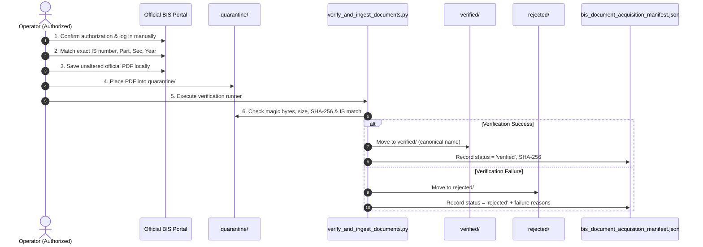

# BISaarthi — Phase 3C: Authorized Manual Document Acquisition Operator Guide

## 1. Overview & Purpose

This guide outlines the standard operating procedure (SOP) for operators legitimately acquiring official Bureau of Indian Standards (BIS) publications for the approved 100-standard BISaarthi MVP corpus (`backend/docs/bis_mvp_corpus_manifest.json`).

BISaarthi relies on a **controlled, operator-assisted manual acquisition and automated cryptographic verification pipeline**. Raw standard documents are never scraped, circumvented, or redistributed.

---

## 2. Strict Legal, Ethical & Security Boundaries

Operators executing manual acquisition must strictly adhere to the following rules:

1. **Legitimate Authorization Only**: Only acquire documents through official, authorized BIS channels (e.g. official institutional access on `standardsbis.bsbedge.com` or `manakonline.in`). The operator must already possess valid authorization.
2. **No Automated Logins**: Do not create or run browser automation, headless scrapers, or scripts to log in to BIS portals.
3. **No Session/Token Scraping**: Do not extract, replay, or script authenticated cookies, session tokens, or API headers.
4. **No Access-Control Bypass**: Never attempt to circumvent CAPTCHAs, paywalls, IP rate limits, or licensing restrictions.
5. **No Guessed or Hidden URLs**: Never attempt to construct hidden URL patterns or query unexposed internal endpoints.
6. **No Leaked Credentials or Keys**: Never use leaked credentials, third-party tokens, or shared unauthorized accounts.
7. **No Third-Party Mirrors**: Strictly reject copies from Scribd, Google Drive, Internet Archive, GitHub, Telegram, WhatsApp, or unofficial mirrors.
8. **No Circumvention of Technical Protections**: Never attempt to strip, alter, or defeat digital rights or security mechanisms on documents.
9. **Metadata Visibility ≠ Download Authorization**: The fact that a standard's title and metadata are visible in the public BIS catalogue does not grant automated download rights.
10. **Internal RAG Use Only (Zero Public Redistribution)**: Acquired documents must remain local assets strictly for internal text extraction, chunking, and search embeddings. BISaarthi will never serve raw PDF downloads.
11. **Keep Binaries Out of Git**: Ensure all downloaded PDFs remain in local directories (`backend/data/bis_documents/`) and are strictly excluded from version control via `.gitignore`.
12. **Correct Status for Unavailable Files**: If legitimate access is unavailable for a standard, the required status is `not_acquired`—never attempt workarounds.

---

## 3. Step-by-Step Operator Workflow



### Step 1 — Confirm Authorization
Confirm you have active, authorized access to the official BIS portal for the target standards.
> [!CAUTION]
> **Zero Credentials in Code**: Never enter usernames, passwords, API tokens, or session cookies into BISaarthi source code, `.env` files, logs, scripts, or commit messages.

### Step 2 — Use Official BIS Access Channels
Navigate to the official portal manually using a standard web browser:
* **BIS Manakonline Portal**: `https://www.manakonline.in`
* **BIS Standards Portal / BSB Edge**: `https://standardsbis.bsbedge.com`

Do not use browser automation or session capture tools.

### Step 3 — Identify the Exact Standard
Consult the authoritative corpus manifest: [`backend/docs/bis_mvp_corpus_manifest.json`](file:///c:/Users/amanm/Desktop/BISaarthi/backend/docs/bis_mvp_corpus_manifest.json).

Verify all structural components before acquiring:
* **IS Number**: Base number (e.g. `IS 2082`, `IS 302`, `IS 456`)
* **Part Number**: (e.g. `Part 1`, `Part 2`)
* **Section Number**: (e.g. `Sec 3`, `Sec 16`)
* **Revision Year**: (e.g. `2018`, `2024`, `2015`)
* **Full Title**: Confirm topic and scope.

> [!WARNING]
> Pay exceptional attention to multi-part standards. For instance, **IS 302 (Part 2/Sec 3):2024** (Electric Irons) must never be substituted for **IS 302 (Part 1):2024** (General Safety) or **IS 302 (Part 2/Sec 16):2026** (Food Processors).

### Step 4 — Acquire the Official Document
Save the official PDF locally.
* **Do not alter the PDF content** in any way.
* **Do not rename the file in a manner that strips standard identification** (keeping default or clear descriptive names like `IS_2082_2018.pdf` is recommended).
* **Do not acquire substitute files** from unverified sources.

### Step 5 — Place Candidate Files in Quarantine
Deposit the candidate PDF into the local quarantine intake directory:
```text
backend/data/bis_documents/quarantine/
```
> [!IMPORTANT]
> Never place candidate files directly into `verified/`. All files must pass through automated verification.

### Step 6 — Run the Verification Pipeline
From the `backend/` directory, run the verification CLI runner:
```powershell
python scripts/verify_and_ingest_documents.py
```

### Step 7 — Review Verification Output
The verifier performs automated checks:
1. **Magic Bytes & Header**: Validates `%PDF-` signature.
2. **File Size Bounds**: Rejects empty files and files exceeding 50 MB.
3. **Path Safety**: Sanitizes filenames against path traversal.
4. **Cryptographic SHA-256**: Generates unique digest.
5. **Exact Standard Disambiguation**: Matches base number, part, section, and year against `bis_mvp_corpus_manifest.json`.
6. **Corpus Allowlist Check**: Rejects standards outside the 100-standard MVP corpus.

* **Accepted Files**: Moved to `backend/data/bis_documents/verified/` under canonical naming (e.g. `IS_2082_2018.pdf`).
* **Rejected Files**: Moved to `backend/data/bis_documents/rejected/` with explicit failure logs.

### Step 8 — Preserve Provenance & Audit Trail
The runner automatically synchronizes [`backend/docs/bis_document_acquisition_manifest.json`](file:///c:/Users/amanm/Desktop/BISaarthi/backend/docs/bis_document_acquisition_manifest.json) and [`backend/docs/bis_document_acquisition_manifest.md`](file:///c:/Users/amanm/Desktop/BISaarthi/backend/docs/bis_document_acquisition_manifest.md), recording:
* Standard IS number and `standard_id`
* Local canonical path and file size
* Full SHA-256 cryptographic digest
* Verification status (`verified` or `rejected`)
* Provenance attribution and `redistribution_restricted: True`

### Step 9 — Git & Security Pre-Commit Check
Before committing changes to Git, always run:
```powershell
git status
```
Verify that `backend/data/bis_documents/verified/` PDF binaries are **not** staged for commit. The repository's `.gitignore` must keep all PDF binaries local.

---

## 4. Batch Acquisition Strategy

Do **not** attempt to acquire all 100 standards at once. Follow an iterative batch strategy:

```text
Batch 1: 5–10 High-Priority Standards (Demo Scenarios)
   ↓
Place in quarantine/ -> Run verifier -> Check manifest
   ↓
Batch 2: 15–20 Standards across Electrical & Construction
   ↓
Place in quarantine/ -> Run verifier -> Check manifest
   ↓
Batch 3: Remaining Categories (Food/Water, Steel, Plastics)
   ↓
Final Manifest & Test Suite Verification
```

### Recommended Initial Validation Batch (5 Standards)
1. `IS 2082:2018` — Stationary storage type electric water heaters
2. `IS 302 (Part 1):2024` — Household electrical appliances safety (General)
3. `IS 456:2000` — Plain and reinforced concrete code of practice
4. `IS 14543:2024` — Packaged drinking water
5. `IS 2062:2011` — Hot rolled medium and high tensile structural steel

---

## 5. Lifecycle Status Reference

| Status | Definition |
| ------ | ---------- |
| `not_acquired` | Default state. No authorized document has been obtained or staged yet. |
| `quarantined` | File is staged in `quarantine/` awaiting verification execution. |
| `verified` | File passed safety, magic byte, SHA-256, and exact identity checks; moved to `verified/`. |
| `rejected` | File failed verification checks or does not match the 100-standard corpus; moved to `rejected/`. |
| `manual_review` | Identity or format could not be unambiguously resolved by the verifier. |

---

## 6. Summary Checklist for Operators

- [ ] I have verified that I have legitimate authorization to access the target standard.
- [ ] I am using official BIS portals directly in my browser without automation.
- [ ] I have matched the exact IS number, Part, Section, and Revision Year from `bis_mvp_corpus_manifest.json`.
- [ ] I have placed the downloaded PDF in `backend/data/bis_documents/quarantine/`.
- [ ] I have executed `python scripts/verify_and_ingest_documents.py`.
- [ ] I have reviewed the generated report in `backend/docs/bis_document_acquisition_manifest.md`.
- [ ] I have confirmed with `git status` that raw PDF files are excluded from version control.
