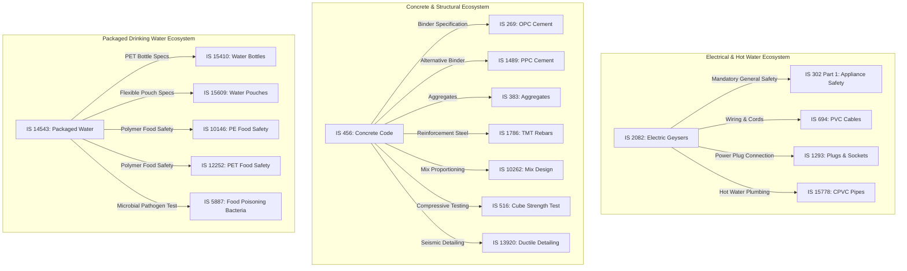

# BISaarthi Curated MVP Knowledge Corpus Manifest

## 1. Overview & Purpose

This document and its companion machine-readable allowlist ([`bis_mvp_corpus_manifest.json`](file:///c:/Users/amanm/Desktop/BISaarthi/backend/docs/bis_mvp_corpus_manifest.json)) define the **curated 100 Indian Standards (IS)** selected from the official Bureau of Indian Standards (BIS) catalogue for the BISaarthi MVP.

> [!IMPORTANT]
> **Strict Ingestion Boundary**:
> This manifest serves as the **exclusive allowlist** for the future BIS ingestion pipeline.
> Future ingestion, extraction, vectorization, and RAG pipelines **MUST ONLY** process the standards listed in this manifest. Ingestion of the full ~24,160+ catalogue is out of scope for the MVP.

---

## 2. Engineering Rationale: Why These Five Categories?

The 5 approved categories were selected to represent high-demand, practical industrial and consumer compliance verticals in India:

1. **Electrical Appliances & Accessories (21 Standards)**:
   - High consumer volume and strict government safety mandates under mandatory ISI and Compulsory Registration Scheme (CRS).
   - High user query frequency regarding product safety, domestic geysers, fans, room heaters, switches, wiring, and LED lighting.
2. **Construction, Cement & Concrete (21 Standards)**:
   - Critical infrastructure and civil engineering sector with deep standard interdependencies (e.g., Cement $\rightarrow$ Aggregates $\rightarrow$ Mix Design $\rightarrow$ Rebars $\rightarrow$ Testing).
   - Essential for demonstrating complex technical comparison and code compliance (e.g., OPC vs PPC vs PSC; IS 456 vs IS 13920).
3. **Food, Drinking Water & Food-Contact Products (20 Standards)**:
   - Stringent public health mandates with mandatory ISI licensing for Packaged Drinking Water (IS 14543) and Mineral Water (IS 13428).
   - Seamless cross-standard relationships between food products, food-grade polymer safety standards (PE, PP, PET, PVC), and microbiological testing methods.
4. **Steel, Metals & Industrial Materials (19 Standards)**:
   - Foundation of heavy engineering, automotive manufacturing, and metal fabrication (structural steel, structural tubes, sheet metals, aluminium extrusions, fasteners).
   - Key demonstration vertical for B2B/industrial compliance queries, mechanical tensile testing, and metallurgy.
5. **Plastics, Packaging & Consumer Materials (19 Standards)**:
   - Extensive packaging ecosystem spanning agricultural sacks, corrugated cartons, rotomoulded water storage tanks, UPVC/HDPE/CPVC piping networks, and timber/plywood.

---

## 3. Curated Corpus Summary by Category

| Category | Target Count | Actual Verified Count | High-Confidence Ratio |
| :--- | :---: | :---: | :---: |
| **1. Electrical Appliances & Accessories** | 20–25 | **21** | 100% |
| **2. Construction, Cement & Concrete** | 20–25 | **21** | 100% |
| **3. Food, Drinking Water & Food-Contact Products** | 15–20 | **20** | 100% |
| **4. Steel, Metals & Industrial Materials** | 15–20 | **19** | 100% |
| **5. Plastics, Packaging & Consumer Materials** | 15–20 | **19** | 100% |
| **Total Curated Standards** | **~100** | **100** | **100%** |

---

## 4. Category 1: Electrical Appliances & Accessories (21 Standards)

### Major Use Cases
- Manufacturing domestic electric storage water heaters / geysers and instant heaters.
- General and product-specific safety conformity under IS 302 series.
- Ceiling and pedestal fan efficiency, air delivery, and BEE star-labelling compliance.
- Domestic wiring, modular switchgear, plugs, sockets, and circuit breakers (MCBs/RCCBs).
- Mandatory BIS CRS registration for consumer LED lamps and LED drivers.

### Standard Catalogue

| IS Number | BIS Standard ID | Title | Technical Committee | Primary Use Case |
| :--- | :---: | :--- | :--- | :--- |
| **IS 2082:2018** | 18707 | Stationary storage type electric water heaters - Specification | ETD 32 (Electrical Appliances) | Manufacturing domestic storage geysers / ISI mark. |
| **IS 302 (Part 1):2024** | 31712 | Safety of Household and Similar Electrical Appliances — General Requirements | ETD 32 (Electrical Appliances) | Foundational safety testing for all domestic electrical appliances. |
| **IS 302 (Part 2/Sec 3):2024** | 31713 | Household and Similar Electrical Appliances — Safety: Electric Irons | ETD 32 (Electrical Appliances) | Manufacturing and testing dry and steam irons. |
| **IS 302 (Part 2/Sec 16):2026** | 67128 | Household and Similar Electrical Appliances — Safety: Food Waste Disposers | ETD 32 (Electrical Appliances) | Kitchen motorized waste disposer safety. |
| **IS 302 (Part 2/Sec 26):2026** | 67135 | Household and Similar Electrical Appliances — Safety: Griddles, Grills and Similar | ETD 32 (Electrical Appliances) | Electric cooking grills and thermal safety. |
| **IS 302 (Part 2/Sec 36):2026** | 67129 | Household and Similar Electrical Appliances — Safety: Commercial Electric Cooking Ranges | ETD 32 (Electrical Appliances) | Commercial kitchen cooking range safety. |
| **IS 369:2019** | 10283 | Household electric direct - Acting room heaters - Performance Requirements | ETD 32 (Electrical Appliances) | Manufacturing convection and radiant room heaters. |
| **IS 374:2019** | 10334 | Specification for electric ceiling type fans and regulators | ETD 33 (Electric Fans) | Ceiling fan manufacturing, air delivery, BEE Star rating. |
| **IS 555:1979** | 12323 | Specification for electric table type fans and regulators | ETD 33 (Electric Fans) | Manufacturing portable, table, and pedestal fans. |
| **IS 2312:1967** | 8843 | Specification for propeller type AC ventilating fans | ETD 33 (Electric Fans) | Industrial and domestic exhaust ventilation fans. |
| **IS 694:2010** | 13826 | Polyvinyl chloride insulated unsheathed and sheathed cables for working voltages up to and including 1100 V | ETD 9 (Power Cables) | Manufacturing domestic building wire and flexible cords. |
| **IS 1293:2019** | 25402 | Plugs and Socket-Outlets for Household and Similar Purposes | ETD 14 (Electrical Wiring Accessories) | Manufacturing 2-pin/3-pin plugs, wall sockets, power strips. |
| **IS 3854:2023** | 29854 | Switches for Domestic and Similar Purposes - Specification | ETD 14 (Electrical Wiring Accessories) | Manufacturing modular and conventional switches. |
| **IS 12640 (Part 1):2024** | 31276 | Residual current operated circuitBreakers without integral overcurrent protection (RCCBs) | ETD 7 (Low Voltage Switchgear) | Domestic distribution board earth-fault protection. |
| **IS/IEC 60898 (Part 1):2015** | 20830 | Electrical accessories - Circuit - Breakers for overcurrent protection (MCBs) | ETD 7 (Low Voltage Switchgear) | Manufacturing miniature circuit breakers. |
| **IS 1554 (Part 1):1988** | 7676 | Specification for PVC insulated (Heavy Duty) electric cables for voltages up to 1100 V | ETD 9 (Power Cables) | Industrial armoured power distribution cables. |
| **IS 16102 (Part 1):2026** | 65893 | Self-Ballasted LED Lamps for General Lighting Services - Part 1 Safety Requirements | ETD 23 (Electric Lamps) | Mandatory BIS CRS registration for consumer LED bulbs. |
| **IS 15885 (Part 1):2011** | 21219 | Safety of lamp controlgear: Part 1 general requirements | ETD 23 (Electric Lamps) | Safety of electronic power supplies and ballasts. |
| **IS 15885 (Part 2/Sec 13):2012** | 21445 | Safety of lamp controlgear: Part 2 particular requirements for DC or AC supplied electronic controlgear for LED modules | ETD 23 (Electric Lamps) | Testing and certifying LED drivers and power supplies. |
| **IS 13252 (Part 22):2019** | 21685 | Information Technology Equipment - Safety Part 22: Equipment Installed Outdoors | LITD 7 (IT and Audio Video) | Outdoor telecom and electronics safety. |
| **IS 398 (Part 2):2025** | 33494 | Aluminium Conductor for Overhead Transmission Purposes - ACSR | ETD 9 (Power Cables) | Manufacturing high-voltage overhead power cables. |

---

## 5. Category 2: Construction, Cement & Concrete (21 Standards)

### Major Use Cases
- Selecting and verifying cement grades (OPC 33/43/53, PPC Fly Ash, PPC Clay, Slag Cement).
- Structural plain and reinforced concrete design under IS 456.
- Designing high-strength and self-compacting concrete mixes (IS 10262).
- Quality testing of aggregates, fresh concrete slump, and hardened compressive cube strength.
- TMT rebar reinforcement compliance (Fe 415, Fe 500, Fe 550, Fe 600).
- Ready-mixed concrete (RMC) batching plant operations and quality auditing.

### Standard Catalogue

| IS Number | BIS Standard ID | Title | Technical Committee | Primary Use Case |
| :--- | :---: | :--- | :--- | :--- |
| **IS 269:2015** | 111 | Ordinary portland cement - Specification | CED 2 (Cement and Lime) | Manufacturing and testing OPC cement (33, 43, 53 grades). |
| **IS 1489 (Part 1) : 2015** | 6875 | Portland Pozzolana Cement - Specification: Part 1 fly Ash Based | CED 2 (Cement and Lime) | Manufacturing fly-ash blended cement. |
| **IS 1489 (Part 2):2015** | 6876 | Portland Pozzolana Cement - Specification: Part 2 Calcined Clay Based | CED 2 (Cement and Lime) | Manufacturing calcined clay blended cement. |
| **IS 455:2015** | 11237 | Portland slag cement - Specification | CED 2 (Cement and Lime) | Slag cement for marine and coastal construction. |
| **IS 456:2000** | 11248 | Plain and reinforced concrete - Code of practice | CED 2 (Cement and Lime) | Structural concrete design and durability compliance. |
| **IS 10262:2019** | 1083 | Concrete Mix Proportioning — Guidelines | CED 2 (Cement and Lime) | Mix design calculations for RMC and site concrete. |
| **IS 383:2016** | 10424 | Coarse and Fine Aggregate for Concrete - Specification | CED 2 (Cement and Lime) | Sourcing, grading, and testing concrete aggregates. |
| **IS 516 (Part 1/Sec 1):2021** | 25684 | Hardened concrete - Methods of test: Compressive Strength | CED 2 (Cement and Lime) | Laboratory compressive strength testing of concrete cubes. |
| **IS 1199 (Part 2):2018** | 23725 | Fresh Concrete - Methods of Sampling, Testing: Determination of Consistency | CED 2 (Cement and Lime) | Fresh concrete slump test and workability verification. |
| **IS 1786:2008** | 8195 | High Strength Deformed Steel Bars and Wires for Concrete Reinforcement | CED 54 (Concrete Reinforcement) | TMT rebar manufacturing and quality testing. |
| **IS 1077:2025** | 33880 | Common Burnt Clay Building Bricks - Specification | CED 30 (Clay and Masonry) | Manufacturing and testing clay masonry bricks. |
| **IS 2185 (Part 1):2005** | 8713 | Concrete masonry units - Specification: Part 1 hollow and solid concrete blocks | CED 53 (Precast Concrete) | Precast load-bearing and partition wall blocks. |
| **IS 2185 (Part 3):1984** | 8715 | Concrete Masonry Units Part 3 Autoclaved Cellular Aerated Concrete Blocks | CED 53 (Precast Concrete) | Manufacturing lightweight AAC building blocks. |
| **IS 4926:2003** | 11646 | Ready - Mixed Concrete - Code of Practice | CED 2 (Cement and Lime) | Operating commercial RMC batching plants. |
| **IS 3495 (Part 1):2019** | 24475 | Burnt Clay Building Bricks — Methods of Tests: Compressive Strength | CED 30 (Clay and Masonry) | Testing brick compressive strength in laboratories. |
| **IS 9103:1999** | 16369 | Concrete Admixtures - Specification | CED 2 (Cement and Lime) | Formulating plasticizers, retarders, and accelerators. |
| **IS 1237:2012** | 3683 | Cement Concrete Flooring Tiles - Specification | CED 53 (Precast Concrete) | Manufacturing and testing terrazzo/cement floor tiles. |
| **Is 15658:2021** | 25365 | Concrete Paving Blocks - Specification | CED 53 (Precast Concrete) | Manufacturing interlocking concrete paver blocks. |
| **IS 2542 (Part 1/Sec 1):2023** | 29188 | Gypsum Plaster, Concrete and Products - Methods of Test: Consistency | CED 21 (Gypsum Products) | Laboratory testing of gypsum plastering materials. |
| **IS 4031 (Part 1):1996** | 10661 | Methods of Physical Tests for Hydraulic Cement: Part 1 Fineness | CED 2 (Cement and Lime) | Quality control testing of cement fineness (Blaine/sieve). |
| **IS 13920:2016** | 5724 | Ductile Design and Detailing of Reinforced Concrete Structures | CED 39 (Earthquake Engineering) | Seismic detailing of beams, columns, and shear walls. |

---

## 6. Category 3: Food, Drinking Water & Food-Contact Products (20 Standards)

### Major Use Cases
- Establishing commercial packaged drinking water and natural mineral water bottling plants.
- Food-contact polymer qualification (PE, PVC, PP, PET, Polystyrene) and migration limits.
- Dairy manufacturing (milk powder, condensed milk, pasteurized liquid milk).
- Infant nutritional formula and complementary weaning foods.
- Microbiological pathogen testing and shelf-life determination.

### Standard Catalogue

| IS Number | BIS Standard ID | Title | Technical Committee | Primary Use Case |
| :--- | :---: | :--- | :--- | :--- |
| **IS 14543:2024** | 30481 | Packaged Drinking Water Other than Packaged Natural Mineral Water | FAD 14 (Drinks and Drinking Water) | Mandatory ISI licensing for packaged drinking water. |
| **IS 13428:2024** | 30480 | PACKAGED NATURAL MINERAL WATER - SPECIFICATION | FAD 14 (Drinks and Drinking Water) | Bottling and testing natural spring mineral water. |
| **IS 10500:2012** | 1333 | Drinking Water - Specification | FAD 14 (Drinks and Drinking Water) | Potable tap water quality parameters. |
| **IS 15410:2025** | 33139 | PLASTIC BOTTLES/CONTAINERS FOR PACKAGING OF NATURAL MINERAL WATER AND PACKAGED DRINKING WATER | PCD 21 (Plastics Packaging) | Manufacturing PET/PC bottles for packaged water. |
| **IS 10146:1982** | 923 | Specification for polyethylene for its safe use in contact with foodstuffs | PCD 12 (Plastics) | Qualifying food-grade virgin polyethylene resins. |
| **IS 10151:2019** | 928 | Polyvinyl chloride (pvc) and its copolymers for its safe use in contact with foodstuffs | PCD 12 (Plastics) | Safety of PVC food films and containers. |
| **IS 10910:1984** | 1888 | Specification for polypropylene and its copolymers for its safe use in contact with foodstuffs | PCD 12 (Plastics) | Manufacturing food-grade PP containers and boxes. |
| **IS 12252:2017** | 3546 | Polyalkylene terephthalates (pet and pbt), their copolymers for contact with foodstuffs | PCD 12 (Plastics) | Food-grade PET resin qualification for beverage bottles. |
| **IS 15609:2005** | 7757 | Polyethylene flexible pouches for the packing of natural mineral water and packaged drinking water | PCD 21 (Plastics Packaging) | Manufacturing flexible pouches for drinking water. |
| **IS 1158:1973** | 2707 | Specification for corn flakes | FAD 16 (Foodgrains) | Manufacturing breakfast corn flakes. |
| **IS 1165:2022** | 27203 | Whole Milk Powder — Specification | FAD 19 (Dairy Products) | Manufacturing spray-dried milk powder. |
| **IS 1166:2022** | 27202 | SWEETENED CONDENSED MILK, SWEETENED CONDENSED PARTLY SKIMMED MILK | FAD 19 (Dairy Products) | Processing canned sweetened condensed milk. |
| **IS 13688:2020** | 5393 | Packaged Pasteurized Milk — Specification | FAD 19 (Dairy Products) | Liquid pasteurized milk processing and distribution. |
| **Is 1656:2022** | 27283 | MILK-CEREAL BASED COMPLEMENTARY FOODS — SPECIFICATION | FAD 19 (Dairy Products) | Fortified baby cereal foods and infant nutrition. |
| **IS 15757:2022** | 27286 | FOLLOW-UP FORMULA-COMPLEMENTARY FOODS - SPECIFICATION | FAD 19 (Dairy Products) | Follow-up infant formula manufacturing. |
| **IS 10325:2026** | 67169 | Square tins of 15 kg or 15 litre capacity for ghee, vanaspati, edible oils and bakery shortenings | PGD 38 (Metal Containers) | Manufacturing 15 kg tin containers for edible oils. |
| **IS 5887 (Part 8/Sec 1):2023** | 28448 | Methods for detection of bacteria responsible for food poisoning | FAD 15 (Food Hygiene) | Microbiological detection of Salmonella and E. coli. |
| **IS 16068:2013** | 229 | Microbiology of food and animal feeding stuffs - Horizontal method for enumeration of yeasts and moulds | FAD 15 (Food Hygiene) | Testing yeasts and moulds in food products. |
| **IS 10142:2025** | 33650 | POLYSTYRENE CRYSTAL AND HIGH IMPACT FOR ITS SAFE USE IN CONTACT WITH FOODSTUFFS | PCD 12 (Plastics) | Disposable food cups, cutlery, and yoghurt cups. |
| **IS 15888:2010** | 21179 | Guideline for the conduct of food safety assessment of foods derived from recombinant-DNA plants | FAD 15 (Food Hygiene) | Regulatory biotechnology food safety auditing. |

---

## 7. Category 4: Steel, Metals & Industrial Materials (19 Standards)

### Major Use Cases
- Sourcing and fabrication of structural steel plates, beams, and columns (IS 2062).
- Manufacturing industrial fluid piping, ERW tubes, and plumbing fittings (IS 1239 series).
- Manufacturing hollow steel structural sections (IS 1161) and mechanical tubes (IS 3601).
- Deep drawing and sheet metal pressing using cold-rolled steel (IS 513) and hot-rolled steel (IS 1079).
- Quality testing using universal tensile testing (IS 1608), Vickers hardness (IS 1501), and Charpy impact (IS 1757).

### Standard Catalogue

| IS Number | BIS Standard ID | Title | Technical Committee | Primary Use Case |
| :--- | :---: | :--- | :--- | :--- |
| **IS 2062 (Part 1):2025** | 65763 | Structural Steel - Part 1 - Hot Rolled Medium and High Tensile | MTD 4 (Wrought Steel) | Manufacturing structural steel plates, angles, channels. |
| **IS 2062 (Part 2):2026** | 66102 | Structural Steel - Part 2 - Hot Rolled Quenched and Tempered | MTD 4 (Wrought Steel) | High-strength quenched steel for heavy machinery. |
| **IS 1239 (Part 1):2004** | 20944 | Steel Tubes, Tubulars and Other Wrought Steel Fittings - Steel Tubes | MTD 19 (Steel Tubes) | ERW and seamless mild steel pipes for water/gas/steam. |
| **IS 1239 (Part 2):2011** | 3714 | Steel tubes, tubulars and other steel fittings - Pipe Fittings | MTD 19 (Steel Tubes) | Manufacturing pipe elbows, tees, and sockets. |
| **IS 1161:2014** | 2740 | Steel tubes for structural purposes - Specification | MTD 19 (Steel Tubes) | Hollow circular/square structural pipe sections. |
| **IS 3601:2006** | 10186 | Steel tubes for mechanical and general engineering purposes | MTD 19 (Steel Tubes) | Mechanical tubing for automotive chassis and shafts. |
| **IS 1079:2017** | 1683 | Hot rolled carbon steel sheet, plate and strip - Specification | MTD 4 (Wrought Steel) | Hot rolled steel stamping and automotive pressings. |
| **IS 513 (Part 1):2016** | 22373 | Cold reduced carbon steel sheet and strip: Part 1 cold forming | MTD 4 (Wrought Steel) | CRCA steel sheets for appliance bodies and automotive. |
| **IS 14246:2024** | 30371 | CONTINUOUSLY PRE-PAINTED GALVANIZED STEEL SHEETS AND STRIPS | MTD 4 (Wrought Steel) | Pre-painted colour coated roofing and wall siding. |
| **IS 2265:2026** | 66431 | Specification for galvanized steel wire strand for signaling | MTD 4 (Wrought Steel) | High-tensile stay wires and railway signal wires. |
| **IS 19068:2025** | 33408 | Continuous hot-dip galvanized steel bars for concrete reinforcement | CED 54 (Concrete Reinforcement) | Corrosion-resistant galvanized rebar for marine concrete. |
| **IS 733:2025** | 65762 | Wrought Aluminium and Aluminium Alloy Bars, Rods, Sections | MTD 7 (Aluminium and Light Metals) | Extruded aluminium profiles for architectural windows. |
| **IS 410:1977** | 10731 | Specification for cold rolled brass sheet, strip and foil | MTD 8 (Copper and Copper Alloys) | Electrical switch terminals and precision brass stampings. |
| **IS 1608 (Part 1):2022** | 26864 | Metallic materials - Tensile testing - Part 1 : Method of test | MTD 1 (Basic Standards) | Measuring tensile yield strength and elongation. |
| **IS 1501 (Part 1):2025** | 33264 | Metallic materials — Vickers hardness test Part 1: Test Method | MTD 1 (Basic Standards) | Measuring micro and macro hardness of metals. |
| **IS 1757 (Part 1):2020** | 8162 | Metallic Materials — Charpy Pendulum Impact Test Part 1 | MTD 1 (Basic Standards) | Testing notch toughness for structural/boiler steels. |
| **IS 3748:2022** | 27687 | Tool Steels - Specification | MTD 16 (Alloy Steels) | High-grade alloy tool steels for cutting dies/moulds. |
| **IS 14894:2023** | 29563 | Fasteners — Hexagon head bolts of product grade | PGD 31 (Fasteners) | Precision structural steel fasteners and bolts. |
| **IS 3745:2024** | 32040 | Yoke Type Medical Cylinder Valve with Pin Index Connection | MTD 8 (Copper and Copper Alloys) | Medical gas cylinder valves and safety connections. |

---

## 8. Category 5: Plastics, Packaging & Consumer Materials (19 Standards)

### Major Use Cases
- Manufacturing municipal potable water pipelines (HDPE pipes IS 4984, UPVC pipes IS 4985).
- Domestic and commercial rotomoulded water storage tanks (IS 12701).
- Quality assurance testing of plastic bottles, jerrycans, and carboys (IS 2798, IS 6312).
- Packaging cartons and shipping boxes (IS 2771) and heavy-duty agro/grain sacks (IS 14887, IS 15351).
- Indoor plumbing, hot-water CPVC pipes (IS 15778), and SWR building drainage (IS 13592).
- Plywood (IS 303) and timber testing (IS 1708).

### Standard Catalogue

| IS Number | BIS Standard ID | Title | Technical Committee | Primary Use Case |
| :--- | :---: | :--- | :--- | :--- |
| **IS 4984:2016** | 11693 | Polyethylene Pipes for Water Supply - Specification | PCD 10 (Plastics Piping) | HDPE pressure pipes for municipal water networks. |
| **IS 4985:2021** | 25779 | Unplasticized PVC Pipes for Potable Water Supplies - Specification | PCD 10 (Plastics Piping) | UPVC rigid pressure pipes for water supply grids. |
| **IS 12701:1996** | 4136 | Rotational moulded polyethylene water storage tanks - specification | PCD 12 (Plastics) | Manufacturing 500L–5000L overhead water tanks. |
| **IS 2798:1998** | 9328 | Methods of test for plastics containers | PCD 21 (Plastics Packaging) | Drop, leakage, and handle strength tests for plastic containers. |
| **IS 6312:1994** | 13171 | Polyethylene containers for the transport of materials | PCD 21 (Plastics Packaging) | Blow-moulded jerrycans for chemicals and detergents. |
| **IS 7803 (Part 1):1975** | 20354 | Specification for plastic containers for pharmaceutical products | PCD 21 (Plastics Packaging) | Pharmaceutical bottles and tamper-evident packaging. |
| **IS 2771 (Part 1):2022** | 26994 | CORRUGATED FIBREBOARD BOXES- SPECIFICATION PART 1 | PGD 39 (Packaging) | Manufacturing 3/5/7-ply shipping cartons. |
| **IS 15351:2015** | 7434 | Agro textiles — Laminated high density polyethylene (HDPE) woven sacks | TXD 33 (Geotextiles) | Weatherproof sacks for fertilizers and agricultural produce. |
| **IS 12818:2010** | 4270 | Unplasticized Polyvinyl Chloride (PVC-U) Screen and Casing Pipes | PCD 10 (Plastics Piping) | Deep borewell casing and groundwater screen pipes. |
| **IS 13592:2013** | 161 | Unplasticized Polyvinyl Chloride (PVC-U) Pipes for Soil and Waste Discharge | PCD 10 (Plastics Piping) | Building SWR drainage and rainwater piping. |
| **IS 15778:2007** | 7976 | Chlorinated Polyvinyl Chloride (CPVC) Pipes for Potable Hot and Cold Water | PCD 10 (Plastics Piping) | Domestic hot and cold water indoor plumbing. |
| **IS 14887:2014** | 6872 | Textiles - High density polyethylene (HDPE)/polypropylene (PP) woven sacks for 50 kg foodgrains | TXD 23 (Woven Sacks) | Bulk foodgrain storage sacks for FCI and mandis. |
| **IS 1708 (Part 1):1986** | 21091 | Determination of moisture content (small clear specimens of timber) | CED 9 (Timber and Wood) | Testing seasoning and moisture in structural timber. |
| **IS 303:2024** | 30791 | Plywood for General Purposes - Specification | CED 20 (Wood and Plywood) | Manufacturing MR and BWR commercial plywood. |
| **IS 16654:2017** | 22499 | Geosynthetics - Polypropylene multifilament woven geobags for riverbank | TXD 33 (Geotextiles) | Riverbank erosion control and flood protection geobags. |
| **IS 5557 (Part 1):2024** | 31420 | All Rubber Gum Boots and Ankle Boots Part 1 Safety Footwear | PCD 13 (Rubber Products) | Industrial safety footwear and chemical protection boots. |
| **IS 6944:2026** | 66137 | Medical Laboratory Glassware — Bijou Bacteriological Bottles | CHD 10 (Glassware) | Glass laboratory culture and bacteriological bottles. |
| **IS 12933 (Part 2):2025** | 65611 | Solar Flat Plate Collector - Specification Part 2 | MED 4 (Solar Energy) | Solar thermal collector casing and absorber plates. |
| **IS 17862:2026** | 67140 | E-Waste Management — Guidelines | CHD 34 (Environment) | Polymer recycling and compliant e-waste handling. |

---

## 9. Cross-Category & Cross-Standard Relationships

---

## 10. Example User Queries Supported by the Corpus

The 100 curated standards directly power the three BISaarthi MVP pillars:

| # | User Question | Feature | Target Manifest Standards |
| :---: | :--- | :--- | :--- |
| **1** | *"I want to manufacture an electric storage water heater. Which BIS standards apply?"* | **Ask BISaarthi** | `IS 2082:2018`, `IS 302 (Part 1):2024`, `IS 694:2010`, `IS 1293:2019` |
| **2** | *"What is the difference between Ordinary Portland Cement (OPC) and Portland Pozzolana Cement (PPC)?"* | **Compare Standards** | `IS 269:2015` vs `IS 1489 (Part 1):2015` |
| **3** | *"What BIS standard applies to commercial packaged drinking water and what are its bottle requirements?"* | **Find Standards** | `IS 14543:2024` (Water), `IS 15410:2025` (PET Bottles), `IS 12252:2017` (Food-grade PET) |
| **4** | *"Which standard specifies high-strength deformed steel bars (TMT rebars) for reinforced concrete?"* | **Find Standards** | `IS 1786:2008` (TMT Rebars), `IS 456:2000` (Concrete Code) |
| **5** | *"What testing requirements apply to Ready-Mixed Concrete (RMC) before discharge?"* | **Ask BISaarthi** | `IS 4926:2003` (RMC), `IS 1199 (Part 2):2018` (Slump test), `IS 516 (Part 1/Sec 1):2021` (Strength) |
| **6** | *"Which standard applies to structural steel for bridge girders and industrial buildings?"* | **Find Standards** | `IS 2062 (Part 1):2025` (Structural Steel), `IS 1608 (Part 1):2022` (Tensile testing) |
| **7** | *"What are the safety requirements for self-ballasted LED lamps under BIS CRS?"* | **Ask BISaarthi** | `IS 16102 (Part 1):2026` (LED Safety), `IS 15885 (Part 2/Sec 13):2012` (LED Driver) |
| **8** | *"Compare HDPE water supply pipes against rigid UPVC water supply pipes."* | **Compare Standards** | `IS 4984:2016` (HDPE) vs `IS 4985:2021` (UPVC) |
| **9** | *"Which standard applies to rotomoulded plastic overhead water storage tanks?"* | **Find Standards** | `IS 12701:1996` (Water Tanks), `IS 2798:1998` (Drop & leakage testing) |
| **10** | *"Why must an electric iron comply with both IS 302 Part 1 and IS 302 Part 2 Section 3?"* | **Ask BISaarthi** | `IS 302 (Part 1):2024` (General safety) + `IS 302 (Part 2/Sec 3):2024` (Iron-specific safety) |

---

## 11. Manifest Integrity & Offline Validation

The integrity of the manifest is continuously validated by automated offline tests in [`backend/tests/test_corpus_manifest.py`](file:///c:/Users/amanm/Desktop/BISaarthi/backend/tests/test_corpus_manifest.py):
- **100 Unique Standards**: Zero duplicates across standard IDs or IS numbers.
- **5 Approved Categories**: Exact mapping to approved engineering categories.
- **100% Real BIS Identifiers**: Every record contains an authentic `standard_id` and `standard_enc_id` verified from `standardsadmin.bis.gov.in`.
- **Zero Mock / Synthetic IDs**: All identifiers directly correspond to official BIS database objects.
